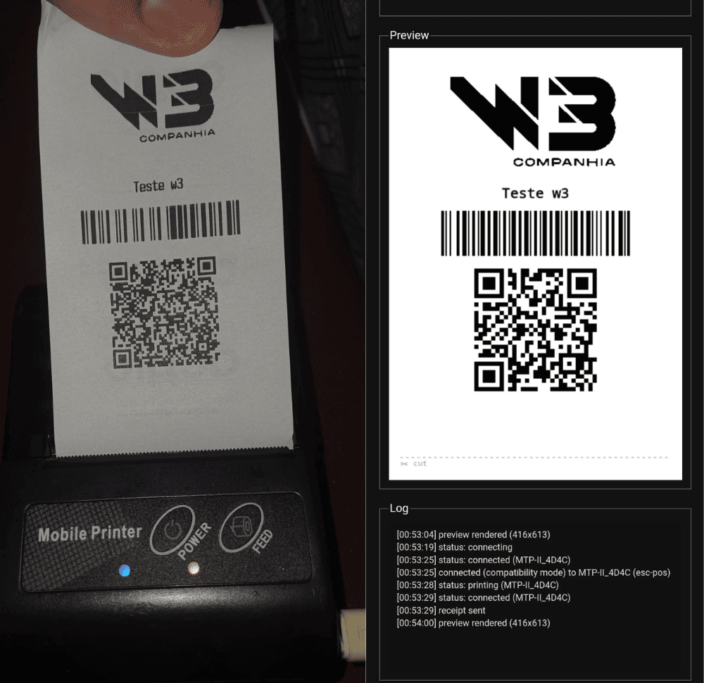

# bluetooth-print-pos

A communication wrapper for thermal receipt printers, over **Web
Bluetooth** or via the **[QZ Tray](https://qz.io)** desktop app (for
USB/OS-registered printers). Builds receipts (text, images, barcodes, QR
codes, PDF417) from a JSON-serializable object and sends them to the
printer — the caller never needs to know anything about ESC/POS encoding.

It wraps [`receipt-printer-encoder`](https://github.com/NielsLeenheer/ReceiptPrinterEncoder)
from the [@point-of-sale](https://point-of-sale.dev) ecosystem to build the
ESC/POS commands. The Web Bluetooth connectivity itself — device discovery,
profile matching, chunked writes — is this project's own code (ported from
[`WebBluetoothReceiptPrinter`](https://github.com/NielsLeenheer/WebBluetoothReceiptPrinter),
see [src/interfaces/bluetooth/](src/interfaces/bluetooth/)), not an external
dependency. QZ Tray connectivity uses the official [`qz-tray`](https://www.npmjs.com/package/qz-tray)
client library (see [src/interfaces/qz/](src/interfaces/qz/)) to talk to the
QZ Tray desktop app, which the user installs and pairs with their printer(s)
separately — this project only hands it the same ESC/POS bytes it already
builds for Bluetooth.

Runs **entirely in the browser, with no Node at runtime** — Node is only
used at build time to produce the artifacts. It also includes a
[print preview](#print-preview) that renders exactly what would be printed
— text, images, barcodes, QR codes, PDF417 — as an image, with no printer needed.



*Left: real receipt off a Bluetooth thermal printer. Right: the exact same
job rendered by [`renderPreview()`](#print-preview) in the browser, with
the connection/print log underneath — no editing, this is the actual
side-by-side test output.*

There are two ways to use it, covered in detail below:

- **[Standalone](#standalone-usage-no-dependencies)** — a single self-contained `<script>` file, zero install, zero dependencies for the consumer.
- **[As an npm package](#npm-package-usage)** — installed into a bundler-based project (Vite, webpack, Vue, etc.), with full TypeScript types.

## Standalone usage (no dependencies)

This is for a plain HTML page or a webview: no bundler, no `npm install`,
no build step at all on the consuming side. The published package already
ships a prebuilt, self-contained UMD bundle at
`build/printer-wrapper.js` — it bundles `@point-of-sale/receipt-printer-encoder`,
`qz-tray`, and all of this project's own Bluetooth connectivity code
internally, so **you don't need to install or reference anything else
yourself**.

Grab that one file — either from
`node_modules/bluetooth-print-pos/build/printer-wrapper.js` after
`npm install bluetooth-print-pos` (just to extract the file, no `import`
needed), from a CDN pointed at the npm package (e.g.
`https://unpkg.com/bluetooth-print-pos/build/printer-wrapper.js`), or built
from source with `npm run build:standalone` — and drop it into a
`<script>` tag:

```html
<script src="printer-wrapper.js"></script>
<script>
  const printer = new PrinterWrapper()

  connectButton.onclick = () => printer.connect() // must be a real user click
  printButton.onclick = () =>
    printer.printReceipt({
      content: [
        { type: 'text', value: 'Hello world', align: 'center', bold: true },
        { type: 'qrcode', value: 'https://example.com' },
      ],
      cut: 'full',
    })
</script>
```

See [demo/index.html](demo/index.html) for a complete working example
(connect, print text, print an image, test print), and
[docker-compose.yml](docker-compose.yml) to run that demo locally behind
nginx on port 3000:

```sh
docker compose up
# open http://localhost:3000/
```

## npm package usage

```sh
npm install bluetooth-print-pos
```

```ts
import PrinterWrapper from 'bluetooth-print-pos'

const printer = new PrinterWrapper()

async function onConnectClick() {
  const info = await printer.connect() // must be called from a click handler
  console.log(`Connected to ${info.name}`)
}

async function onPrintClick() {
  await printer.printReceipt({
    content: [
      { type: 'image', source: logoDataUrl }, // base64, File, Blob, URL or HTMLImageElement
      { type: 'text', value: 'Test receipt' },
      { type: 'barcode', value: '123456789012', symbology: 'code128' },
    ],
  })
}
```

The published ESM build treats `@point-of-sale/receipt-printer-encoder` and
`qz-tray` as externals rather than bundling them, so they come along as
regular npm `dependencies` and your own bundler (Vite/webpack) resolves and
dedupes them normally — `npm install` will pull `qz-tray` in for you as a
transitive dependency either way. Bluetooth connectivity is this project's
own source, so it's always bundled in either build. Full TypeScript
declarations (`PrintJob`, `PrintJobElement`, `PrinterStatusEvent`, etc.)
ship in `build/types` — the `import` above already gives you autocomplete.

### `require()` usage — same self-contained bundle as standalone

If your project uses `require()` instead of `import` — a Vue 2 app, an
older webpack config, or plain Node-based tooling — `bluetooth-print-pos`
resolves to the **same self-contained bundle as the
[standalone](#standalone-usage-no-dependencies) `<script>` version**, not
the ESM one. `@point-of-sale/receipt-printer-encoder` is already bundled in,
so you don't need it as a separate dependency on this path either.

```js
const PrinterWrapper = require('bluetooth-print-pos')

const printer = new PrinterWrapper()
```

Everything else — `connect()`, `printReceipt()`, image handling, etc. —
works exactly like the example above.

This works because the package's `exports` map routes the `require`
condition to `build/printer-wrapper.js` (UMD, self-contained) while
`import` routes to `build/printer-wrapper.esm.js` (externals) — same
library, two different bundles depending on how you pull it in.

## API

```ts
class PrinterWrapper {
  static isSupported(): boolean     // Web Bluetooth support
  static isQzSupported(): boolean   // WebSocket support (not whether QZ Tray itself is running — only connect() can tell you that)

  constructor(config?: PrinterWrapperConfigInput)

  onStatusChange(cb: (event: PrinterStatusEvent) => void): () => void

  connect(options?: { transport?: 'bluetooth'; compat?: boolean } | { transport: 'qz'; printerName?: string }): Promise<PrinterInfo>
  // Bluetooth (default) must be called from a user click. QZ Tray has no native device
  // picker — use listQzPrinters() first to get a printerName.
  listQzPrinters(query?: string): Promise<string[]>   // QZ Tray only — opens the QZ session if needed
  disconnect(): Promise<void>
  isConnected(): boolean
  getPrinterInfo(): PrinterInfo | null

  printReceipt(job: PrintJob): Promise<void>
  printRaw(bytes: Uint8Array | number[]): Promise<void>

  renderPreview(job: PrintJob): Promise<PrintPreview>                              // no printer/connection needed
  static renderPreview(job: PrintJob, config?: PrinterWrapperConfigInput): Promise<PrintPreview>
}
```

`PrintJob.content` is an ordered list of elements: `text`, `image`,
`barcode`, `qrcode`, `pdf417`, `newline`, `rule`. See
[src/types.ts](src/types.ts) for the full shape of each one.

Errors arrive as a rejected Promise with a `.code`:
`unsupported | user-gesture-required | connect-cancelled | connect-failed | not-connected | busy | print-failed`.

### Text alignment, including justify

A `text` element's `align` accepts `'left' | 'center' | 'right' | 'justify'`
(the other elements — `image`/`barcode`/`qrcode`/`pdf417` — only take the
first three, alignment doesn't apply to `'justify'` there):

```ts
{ type: 'text', value: 'Lorem ipsum dolor sit amet...', align: 'justify' }
```

`'justify'` stretches every line to the full paper width by distributing
extra spaces between words — except a paragraph's last line, which is left
ragged (standard convention, same as word processors). A single word too
long to fit a line on its own is hyphenated (`-`) at the break instead of
being cut silently.

Alignment doesn't rely on the printer's own ESC/POS align command — some
cheap clone printers don't honor it for plain text. Instead, every line is
padded/justified into an exact-width string and sent as raw bytes, so
alignment is correct on any hardware.

### Printer type and paper size

Paper width, protocol and codepage can all be injected — either once at
construction time, or per print job (a per-job value always overrides the
constructor's):

```ts
const printer = new PrinterWrapper({
  paperWidth: '80mm',       // '58mm' | '80mm' | '112mm' — shorthand for `columns` AND the image/barcode width ceiling
  language: 'star-prnt',    // 'esc-pos' | 'star-prnt' | 'star-line', default 'esc-pos'
  codepageMapping: 'xprinter', // for non-standard clone printers; forwarded as-is to ReceiptPrinterEncoder
  printerModel: 'epson-tm-t88vi', // lets ReceiptPrinterEncoder auto-configure known-model defaults
  feedBeforeCut: 4,          // blank lines fed before the physical cut, default 4 — see below
})

// or per job:
await printer.printReceipt({ paperWidth: '58mm', content: [...] })
```

Note this is independent from `connect()`/`connect({ compat: true })`: the
`language`/`codepageMapping` a Bluetooth profile reports on `PrinterInfo`
after connecting is informational only — it isn't applied to
`printReceipt()` automatically, so set it explicitly if you need it.

**`feedBeforeCut`**: the physical cutter sits some distance below the print
head on every thermal printer, so a few blank lines need to feed through
before the cut — otherwise the blade fires too close and slices through the
last thing you printed (worse for tall elements like a PDF417 barcode than
a single line of text). The default of `4` matches the most common value
across known printer models; if you still see content getting clipped by
the cut on your specific hardware, raise it (e.g. `feedBeforeCut: 6`). A
recognized `printerModel` overrides this automatically with its own known
value when set.

### Compatibility mode

`connect()` normally restricts the Bluetooth device picker to a small set
of recognized printer profiles, so unrecognized models sometimes never show
up as an option at all. Pass `{ compat: true }` to widen it: the picker
lists every nearby Bluetooth device, and the printer profile is matched
*after* connecting instead.

```ts
await printer.connect({ compat: true })
```

Try this when a printer doesn't show up, or doesn't connect, with the plain
`connect()`. It reaches more hardware (including generic FF00-profile and
PrinterBT/innoPrint-based printers) at the cost of a noisier device picker.

### QZ Tray transport (USB and other OS-registered printers)

If Web Bluetooth isn't an option — a USB-only printer, or a browser without
Bluetooth support — connect through [QZ Tray](https://qz.io) instead. Install
the QZ Tray desktop app once and pair it with your printer(s) directly; this
library then just hands it the same ESC/POS bytes over QZ Tray's local
websocket API.

QZ has no native OS device picker the way Web Bluetooth does, so list
printers yourself and let the user (or your own logic) pick one:

```ts
const printerNames = await printer.listQzPrinters() // opens the QZ Tray session if needed
const info = await printer.connect({ transport: 'qz', printerName: printerNames[0] })
console.log(`Connected (QZ) to ${info.name}`)

await printer.printReceipt({ content: [{ type: 'text', value: 'Hello from QZ Tray' }] })
```

Omit `printerName` to fall back to QZ Tray's own default printer:

```ts
await printer.connect({ transport: 'qz' })
```

**Unsigned/demo mode only**: this library doesn't configure QZ Tray's
certificate/signature plumbing (`qz.security.setCertificatePromise`/
`setSignaturePromise`), since that requires a private-key signing operation
only your own backend can safely perform. Without it, QZ Tray shows its own
permission popup on each connect/print request instead of printing silently
— see [QZ Tray's own docs](https://qz.io/wiki/2.0-signing-messages) if you
need signed/silent printing.

## Print preview

`renderPreview(job)` renders a `PrintJob` to a canvas that simulates
*exactly* what would come out of the printer — same text wrapping, same
image resize + dithering (byte-identical to the real print, via the same
`canvas-dither` the encoder uses internally), real scannable Code128/ITF
barcodes, QR codes and PDF417 — without a printer, without connecting, and without
even a browser that supports Web Bluetooth. Use it to catch layout/content
mistakes (cut-off text, distorted images, wrong paper width, bad barcode
data) before ever touching hardware.

```ts
const preview = await printer.renderPreview(job)
// preview: { canvas: HTMLCanvasElement, dataUrl: string, width: number, height: number }
```

Also available as a static method, so it works with zero setup — no
instance, no connection:

```ts
const preview = await PrinterWrapper.renderPreview(job, { paperWidth: '80mm' })
```

`preview.dataUrl` is a `data:image/png` string — drop it straight into an
``, in plain HTML, React or Vue:

```html
<!-- plain HTML -->

<script>
  const preview = await printer.renderPreview(job)
  document.getElementById('previewImg').src = preview.dataUrl
</script>
```

```jsx
// React
const [preview, setPreview] = useState(null)
useEffect(() => { printer.renderPreview(job).then(setPreview) }, [job])
return preview && 
```

```vue
<!-- Vue -->

```
```ts
const preview = ref(null)
onMounted(async () => { preview.value = await printer.renderPreview(job) })
```

**Scope note**: real barcode rendering covers `symbology: 'code128'` (the
default) and `'itf'`/`'interleaved-2-of-5'` (bank slip/boleto-style numeric
codes) — other symbologies (upc/ean13/code39/etc.) render as a labeled
placeholder box instead of a real symbol, since implementing every ESC/POS
symbology was out of scope for this pass. `pdf417` (a separate element
type, not a `barcode` symbology) always renders a real, scannable 2D
symbol in preview, via `@bwip-js/browser`:

```ts
{ type: 'pdf417', value: 'anything, not just numbers', truncated: false }
```

`truncated: true` produces the truncated PDF417 variant — fewer bars per
row, no right-side row-indicator columns or stop pattern, useful when
paper width is tight. `columns`/`rows`/`errorlevel` are also available to
tune the symbol's shape and error-correction level; see
[src/types.ts](src/types.ts) for the full option list.

**Preview vs. real print shape**: when `columns` isn't set, the *real*
print's PDF417 layout is chosen by the printer's own firmware, while the
preview's is chosen by `@bwip-js/browser` — two independent implementations
that can pick different (but equally valid and scannable) grid shapes for
the same data. To keep them visually matching, this library picks a
paper-width-appropriate default `columns` (`3`/`7`/`12` for `58mm`/`80mm`/
`112mm`) and applies it identically on both sides, falling back to fully
automatic sizing (the previous behavior) for values too large to fit that
column count. An explicit `columns` in the job always overrides this and is
never second-guessed. The preview also matches the real encoder's default
`errorlevel` (`1`) when the job doesn't set one — bwip-js's own unset
default is a different, higher level, which otherwise renders a taller
symbol (more error-correction codewords) than the real print for the exact
same data and `columns`.

**"Too wide" warning**: some codes — a 44-digit boleto barcode is the
classic case — are physically wider than the paper once rendered, and a
real printer just prints its own `wide error!` instead of the barcode. The
preview shows this ahead of time: it draws the barcode at its real size
(clipped by the canvas edge, same as it'd be cut off in reality) with a red
outline and a message telling you to reduce `width` or use a wider
`paperWidth`. This is advisory only — `printReceipt()` always attempts the
print regardless, since the real limit depends on the specific printer
hardware, not just the configured paper width.

## Building from source

```sh
npm install
npm run build              # builds everything: UMD + ESM + .d.ts (what gets published to npm)
npm run build:standalone   # builds only build/printer-wrapper.js (the standalone UMD bundle)
npm run build:dev          # same as `build`, in watch mode
```

## License

MIT

Note: the standalone UMD bundle (`build/printer-wrapper.js`) statically
includes [`qz-tray`](https://www.npmjs.com/package/qz-tray), which is
licensed **LGPL-2.1** (every other bundled dependency is MIT). If you
redistribute that bundle, check LGPL-2.1's compliance requirements for your
use case.
